# Gallery Zero

Color themes for macOS Terminal, curated from the permanent collection.

Each work translates a painter's color relationships into the sixteen ANSI values that define a terminal session. The background becomes the canvas. The text becomes the light.

---

## The Rothko Collection

Seven profiles after Mark Rothko (1903–1970). Oil on canvas, reconsidered as phosphor on glass.

### Black and Orange

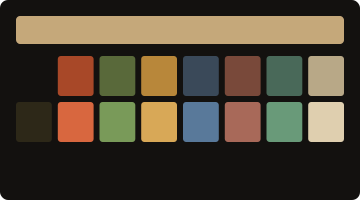

A meditation on warmth and void. After *Black in Deep Red*, 1957.

### Blue and Grey

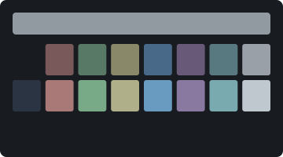

Quiet registers of distance. After *No. 1 (Royal Red and Blue)*, 1954.

### Blue Divided by Blue

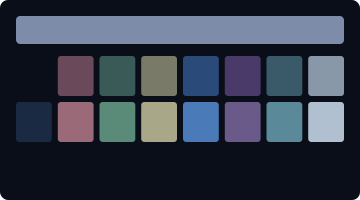

The line between knowing and not knowing. After the late blue works, 1968–69.

### Earth and Green

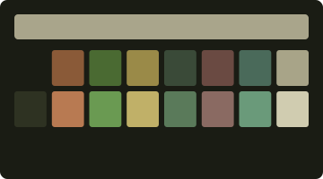

Ground and growth. After *Green and Tangerine on Red*, 1956.

### Green on Tangerine

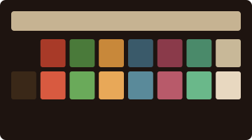

The appetite of color against color. After the multiforms, 1948–49.

### No. 14

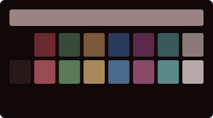

All surface, no edge. After *No. 14*, 1960.

### Seagram Murals


The commission he returned. Maroon and black for a restaurant he decided did not deserve them. After the Seagram murals, 1958–59.

---

## The De Amaral Collection

Seven profiles after Olga de Amaral (b. 1932). Gold leaf and horsehair, reconsidered as phosphor on glass.

### Muro Tejido

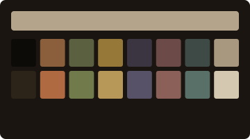

Raw wool and silence. After the woven walls, 1970s.

### Hojarasca

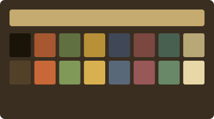

What the forest floor remembers. After the leaf-litter series, late 1970s.

### Alquimia


Fiber becoming gold. After the *Alquimia* series, 1984.

### Alquimia Plata

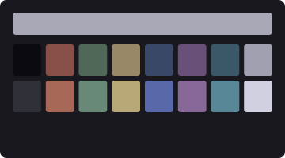

The same transformation, by moonlight. After the silver alchemy works, 1980s–90s.

### Strata

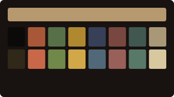

Earth compressed into memory. After the *Strata* series, 2000s.

### Bruma

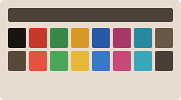

Thread released from gravity. After the *Bruma* series, 2010s.

### Sol

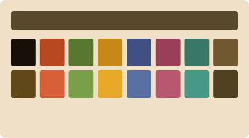

The light the gold was always borrowing. After the radiant works spanning her career.

---

## The Condo Collection

Seven profiles after George Condo (b. 1957). Psychological Cubism, reconsidered as phosphor on glass.

### Dancing to Miles

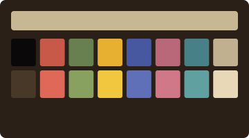

The jazz before the fracture. After *Dancing to Miles*, 1985.

### Artificial Realism

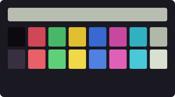

The realistic representation of that which is artificial. After the term he coined in the 1980s.

### Antipodal


Colors that shouldn't be in the same room together. After the Antipodal portraits, 2000s.

### Mental States

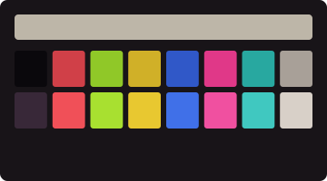

Every emotion at once. After the *Mental States* series, 2011.

### Dreams and Nightmares

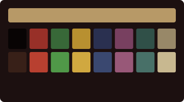

Old Masters, badly dreaming. After *Dreams and Nightmares of the Queen*, 2006.

### People Are Strange

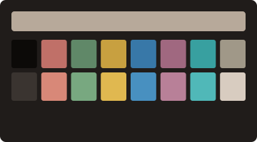

A well-dressed argument. After the exhibition, 2023.

### Diagonal

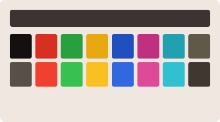

Cascading color, departing from the portrait. After the Diagonal series, 2023–24.

---

## Acquisitions

Double-click any `.terminal` file. It will appear in **Terminal → Preferences → Profiles**. Select it. Set it as default if you like.

Or, from the command line:

```sh
open "rothko/Rothko — Black and Orange.terminal"
open "de-amaral/De Amaral — Alquimia.terminal"
open "condo/Condo — Antipodal.terminal"
```

## Forthcoming Exhibitions

New artist series are underway. The gallery accepts loans.
