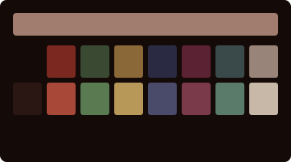
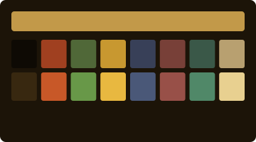
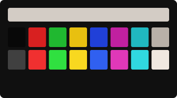
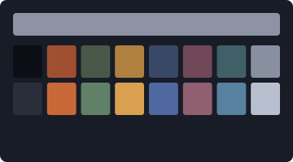

# Gallery Zero

Color themes for macOS Terminal, curated from the permanent collection.

Each work translates a painter's color relationships into the sixteen ANSI values that define a terminal session. The background becomes the canvas. The text becomes the light.

---

## The Rothko Collection

Seven profiles after Mark Rothko (1903–1970). Oil on canvas, reconsidered as phosphor on glass.

### Seagram Murals



The commission he returned. Maroon and black for a restaurant he decided did not deserve them. After the Seagram murals, 1958–59.

[Enter the Rothko gallery.](rothko/)

---

## The De Amaral Collection

Seven profiles after Olga de Amaral (b. 1932). Gold leaf and horsehair, reconsidered as phosphor on glass.

### Alquimia



Fiber becoming gold. After the *Alquimia* series, 1984.

[Enter the De Amaral gallery.](de-amaral/)

---

## The Condo Collection

Seven profiles after George Condo (b. 1957). Psychological Cubism, reconsidered as phosphor on glass.

### Antipodal



Colors that shouldn't be in the same room together. After the Antipodal portraits, 2000s.

[Enter the Condo gallery.](condo/)

---

## The Monet Collection

Seven profiles after Claude Monet (1840–1926). Plein air and lily ponds, reconsidered as phosphor on glass.

### Brume



The painting that named a movement, before the sun burned through. After *Impression, Sunrise*, 1872.

[Enter the Monet gallery.](monet/)

---

## Acquisitions

Double-click any `.terminal` file. It will appear in **Terminal → Preferences → Profiles**. Select it. Set it as default if you like.

Or, from the command line:

```sh
open "rothko/Rothko — Seagram Murals.terminal"
open "de-amaral/De Amaral — Alquimia.terminal"
open "condo/Condo — Antipodal.terminal"
open "monet/Monet — Brume.terminal"
```

## Forthcoming Exhibitions

New artist series are underway. The gallery accepts loans.
