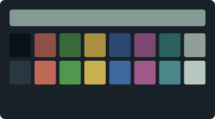
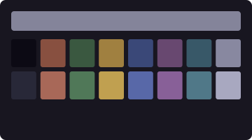

# The Monet Collection

Seven profiles after Claude Monet (1840–1926). Plein air and lily ponds, reconsidered as phosphor on glass.

Seven studies in how the same world changes when the light does. Monet painted haystacks at dawn and again at noon not because the hay had changed, but because the air between his eye and the canvas had. These seven themes track a single day's light from harbor fog to Parliament twilight — the background itself brightening and dimming as the sun crosses.

---

### Brume


The painting that named a movement, before the sun burned through. After *Impression, Sunrise*, 1872.

### Nymphéas



Sky in water, water in sky. The garden before the gardener arrives. After the *Water Lilies*, c. 1914–26.

### Effet du Matin


Stone remembering the light it held yesterday. After the *Rouen Cathedral* series, 1894.

### Plein Soleil


Red in the green, green in the everything. After *Poppies at Argenteuil*, 1873.

### Lumière Dorée


The hour when shadows are longer than what casts them. After the *Haystacks*, 1890.

### Soleil Couchant


Venice dissolving into its own reflection. After *San Giorgio Maggiore at Dusk*, 1908.

### Crépuscule



Parliament through fog. The empire, dimly. After *Houses of Parliament, London*, 1904.

---

## Acquisition

Double-click any `.terminal` file in this directory. It will appear in **Terminal → Preferences → Profiles**. Select it. Set it as default if you like.

Or, from the command line:

```sh
open "Monet — Brume.terminal"
open "Monet — Nymphéas.terminal"
```

---

[Return to the main gallery.](../README.md)
