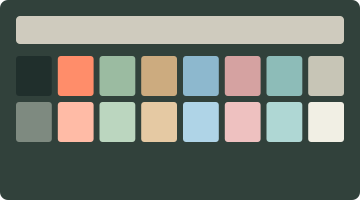
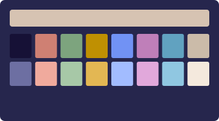

# The Monet Collection

Seven profiles after Claude Monet (1840–1926). Plein air and lily ponds, reconsidered as phosphor on glass.

Seven studies in how the same world changes when the light does. Monet painted haystacks at dawn and again at noon not because the hay had changed, but because the air between his eye and the canvas had. These seven themes track a single day's light from harbor fog to Parliament twilight — the background itself brightening and dimming as the sun crosses.

---

### Brume



The painting that named a movement, before the sun burned through. After *Impression, Sunrise*, 1872.

### Nymphéas


Sky in water, water in sky. The garden before the gardener arrives. After the *Water Lilies*, c. 1914–26.

### Effet du Matin



Stone remembering the light it held yesterday. After the *Rouen Cathedral* series, 1894.

### Plein Soleil


Red in the green, green in the everything. After *Poppies at Argenteuil*, 1873.

### Lumière Dorée


The hour when shadows are longer than what casts them. After the *Haystacks*, 1890.

### Soleil Couchant


The cliff at Étretat gone dark against the setting sun, with the sea still holding the light. After *The Cliff, Étretat, Sunset*, 1882–83.

### Crépuscule


Parliament through fog. The empire, dimly. After *Houses of Parliament, London*, 1904.

---

## Palette

Each palette is sampled from an image of its painting, and the sixteen ANSI colors are drawn from the pigments Monet listed in 1905 — lead white, cadmium yellow, vermilion, madder, cobalt blue and viridian — plus the cobalt violet and ultramarine in his colourman's records ([Roy, *National Gallery Technical Bulletin* 28, 2007](https://www.nationalgallery.org.uk/media/15524/roy2007.pdf)). Black is "very rarely present" in his paintings, so ANSI black is a colored shadow rather than near-black.

Each painting's dominant pair of colors runs at full strength and the rest stay quieter: viridian against cobalt violet in *Nymphéas*, cadmium yellow against blue in *Effet du Matin*, the orange sun against the ultramarine cliff in *Soleil Couchant*. *Crépuscule* lays its twelve ANSI colors along the single arc of hue the Parliament canvas runs through, from lavender through rose and coral to olive-gold.

On the five dark grounds every ANSI color except black and bright black reaches 4.5:1 contrast; bright black stays dimmer on purpose, for comments and secondary text. On the two light grounds the white and bright variants fall below that (and yellow on *Plein Soleil*); Terminal's dynamic ANSI foregrounds adjust those at render time.

---

## Framing

Every frame is a uniform 110×30, and the glass is cut to the weather. *Brume* and *Soleil Couchant* sit behind the thinnest panes (94% opaque), while the crusted stone of *Effet du Matin* and the full daylight of *Plein Soleil* sit behind the densest (97–98%). Line spacing opens with the atmosphere, widest over the lily pond and the Parliament fog. The cursor blinks only where something burns: the poppy field at noon, the sun at Étretat.

Each title bar carries a museum placard — *Nymphéas — Monet, 1914–26* — alongside the working directory. The full recipe per theme lives in [`themes/monet.json`](../themes/monet.json), and the techniques are documented in [TECHNIQUES.md](../TECHNIQUES.md).

---

## Acquisition

Double-click any `.terminal` file in this directory. It will appear in **Terminal → Preferences → Profiles**. Select it. Set it as default if you like.

Or, from the command line:

```sh
open "Monet — Brume.terminal"
open "Monet — Nymphéas.terminal"
```

---

[Return to the main gallery.](../README.md)
