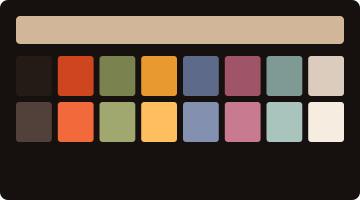

# The Pelton Collection

Seven profiles after Agnes Pelton (1881–1961). Transcendental light, reconsidered as phosphor on glass.

Seven studies in luminosity. Pelton painted alone at the edge of the Mojave, translating what she called the world behind appearances into veils of color, stars, and orbs — canvases that rise out of darkness into incandescence. Five themes keep her night grounds, two her pale luminous ones. And for the first time in this gallery, four profiles are hung as she would have wanted: translucent. The veil themes carry a whisper of transparency and a frosted blur, so the desktop glows faintly through the dark — felt more than seen.

---

### Ahmi in Egypt


A red path snakes up from the lower darkness toward a golden lotus and a bejeweled swan. Indigo night, lit from within. Veiled. After *Ahmi in Egypt*, 1931.

### Messengers


Starlight crossing a great distance of blue to arrive exactly here. Pale gold announcements in a deep night. Veiled. After *Messengers*, 1932.

### Mount of Flame



Fire held in dense darkness — the one canvas whose power is mass, not mist. The collection's single opaque dark. After *Mount of Flame*, 1932.

### Sea Change


Submarine blue-greens and pearl, the light of a world seen through water. The most literally translucent canvas she painted. Veiled. After *Sea Change*, 1931.

### Orbits


Celestial spheres suspended in a depth of violet sky, each keeping its appointed distance. Veiled. After *Orbits*, 1934.

### The Fountains


A misty gray-blue orb on an ethereal ground of ambiguous origin. Her earliest abstraction here, and the gallery's palest room. After *The Fountains*, 1926.

### Incarnation


A rose bloom floating on a glowing golden ground, blue mountain shards beneath. Light that appears to have a body. After *Incarnation*, 1929.

---

## Framing

Every frame is a uniform 110×30, and the glass keeps the veil this collection was born with. *Ahmi in Egypt*, *Messengers*, and *Orbits* share one pane — 96% opacity, lightly frosted — while *Sea Change*, the most literally translucent canvas she painted, thins a shade further. Only *Mount of Flame* hangs opaque: power is mass, not mist, and it carries the collection's one blinking ember. Everywhere else the cursor is still and the line spacing is wide — widest where the spheres keep their appointed distance. If you prefer your darkness absolute, raise the opacity under **Terminal → Preferences → Profiles → Window**.

Each title bar carries a museum placard — *Orbits — Pelton, 1934* — alongside the working directory. The full recipe per theme lives in [`themes/pelton.json`](../themes/pelton.json), and the techniques are documented in [TECHNIQUES.md](../TECHNIQUES.md).

---

## Acquisition

Double-click any `.terminal` file in this directory. It will appear in **Terminal → Preferences → Profiles**. Select it. Set it as default if you like.

Or, from the command line:

```sh
open "Pelton — Ahmi in Egypt.terminal"
open "Pelton — The Fountains.terminal"
```

---

[Return to the main gallery.](../README.md)
