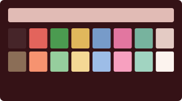
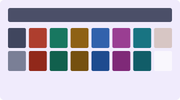

# The Pelton Collection

Seven profiles after Agnes Pelton (1881–1961). Transcendental light, reconsidered as phosphor on glass.

Seven studies in luminosity. Pelton painted alone at the edge of the Mojave, translating what she called the world behind appearances into veils of color, stars, and orbs — canvases that rise out of darkness into incandescence. Five themes keep her night grounds, two her pale luminous ones. And for the first time in this gallery, four profiles are hung as she would have wanted: translucent. The veil themes carry a whisper of transparency and a frosted blur, so the desktop glows faintly through the dark — felt more than seen.

---

### Ahmi in Egypt


A red path snakes up from the lower darkness toward a golden lotus and a bejeweled swan. Indigo night, lit from within. Veiled. After *Ahmi in Egypt*, 1931.

### Messengers


Palm fronds of pale gold above a tall cone of light, with ultramarine water and rose-lit peaks below. A steel-blue dusk ground with quiet accents. Veiled. After *Messengers*, 1932.

### Sea Change


Submarine blue-greens and pearl, the light of a world seen through water. The most literally translucent canvas she painted. Veiled. After *Sea Change*, 1931.

### Orbits


Stars on looping orbits under a lavender cloud: amber, lemon, cobalt, rose, lilac and cyan at full strength on near-black navy. Veiled. After *Orbits*, 1934.

### Tall Ginger



Coral and pink ginger blooms among dark leaves, on a maroon ground that warms to salmon. Painted after her 1923–24 stay in Hawaii, and her first symmetrical composition. The collection's one opaque profile. After *Tall Ginger*, c. 1925.

### The Fountains


A grey orb inside an iridescent veil, lit by a pale yellow sun. Lemon ground, slate text, and the bubbles' rose, green, gold, blue and violet. Her earliest abstraction here. After *The Fountains*, 1926.

### Winter



A lavender-white arch glowing pink from within, between snow-covered trees, under a blue sphere. The arch is the ground, its pink glow the selection, and the canvas's slate the text. After *Winter*, 1933.

---

## Framing

Every frame is a uniform 110×30, and the glass keeps the veil this collection was born with. *Ahmi in Egypt*, *Messengers*, and *Orbits* share one pane — 96% opacity, lightly frosted — while *Sea Change*, the most literally translucent canvas she painted, thins a shade further. Only *Tall Ginger* hangs opaque, and it has the collection's one blinking cursor. Everywhere else the cursor is still and the line spacing is wide — widest in *Orbits*. If you prefer your darkness absolute, raise the opacity under **Terminal → Preferences → Profiles → Window**.

Each title bar carries a museum placard — *Orbits — Pelton, 1934* — alongside the working directory. The full recipe per theme lives in [`themes/pelton.json`](../themes/pelton.json), and the techniques are documented in [TECHNIQUES.md](../TECHNIQUES.md).

---

## Acquisition

Double-click any `.terminal` file in this directory. It will appear in **Terminal → Preferences → Profiles**. Select it. Set it as default if you like.

Or, from the command line:

```sh
open "Pelton — Ahmi in Egypt.terminal"
open "Pelton — The Fountains.terminal"
```

---

[Return to the main gallery.](../README.md)
