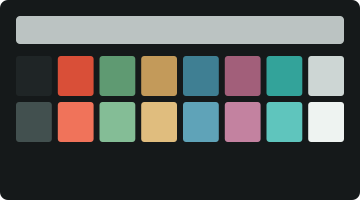
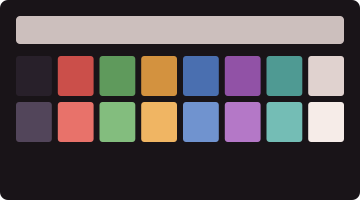
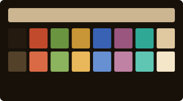
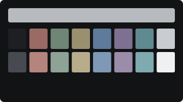

# The Riley Collection

Seven profiles after Bridget Riley (b. 1931). Perceptual geometry, reconsidered as phosphor on glass.

Seven studies in colour as a system. Riley built paintings like precise machines for the eye — stripes, curves, and lozenges deployed in strict repeating sequences until the surface begins to move. Five themes trace her colour years, from the morning she first let red, blue, and green into the work to the fixed "Egyptian palette" she carried home from the Nile. Two more return to the black-and-white op art that started it all — including the gallery's first light room.

---

### Late Morning


Red, blue, and green stood in rows until the eye mixed a green no one painted. The morning she let colour in. After *Late Morning*, 1967–68.

### Cataract



Vermilion and turquoise unfurl like ribbons, warm against cold, new colours surfacing where the edges meet. After *Cataract 3*, 1967.

### Nataraja



Lozenges of orange, violet, and green stacked into rhythm and counter-rhythm. Named for the dancer who keeps the universe in motion. After *Nataraja*, 1993.

### To a Summer's Day


Pale waves of blue, violet, pink, and ochre, twisting like light on moving water. After *To a Summer's Day 2*, 1980.

### Ka



The Egyptian palette — brick red, ochre, blue, turquoise, green — carried home from the Nile and fixed into law. After *Ka*, 1980.

### Movement in Squares


Black squares compress toward a fold that isn't there. The painting that started Op Art, hung in the gallery's first light room. After *Movement in Squares*, 1961.

### Fall



A single curve, repeated until the surface vibrates at the edge of stillness. After *Fall*, 1963.

---

## Acquisition

Double-click any `.terminal` file in this directory. It will appear in **Terminal → Preferences → Profiles**. Select it. Set it as default if you like.

Or, from the command line:

```sh
open "Riley — Movement in Squares.terminal"
open "Riley — Ka.terminal"
```

---

[Return to the main gallery.](../README.md)
