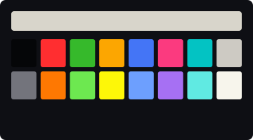
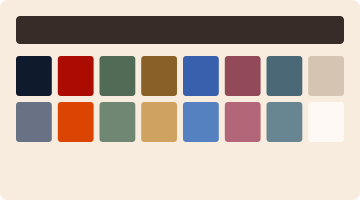
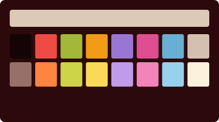
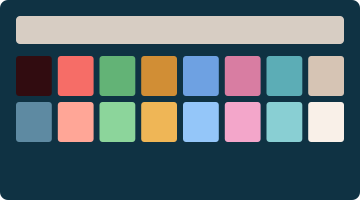
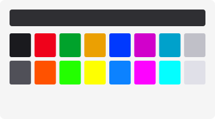

# The Tanaka Collection

Seven profiles after Atsuko Tanaka (1932–2005). Neon circuits and painted light, rewired as phosphor on glass.

Seven studies in what happens when you wire color directly into the wall. Tanaka spent fifty years painting circles connected by lines — circuit diagrams that hum with the energy of Osaka's neon district. Her vinyl paint glows like signage. Her white grounds buzz like gallery lighting. These seven themes trace the arc from first spark to full blaze to the late-night clarity when only the essential signs are still lit.

---

### Electric Dress



Two hundred bulbs in nine colors, worn like a second skin. The circuit that started everything. After *Electric Dress (Denkifuku)*, 1956.

### Red and Black



Two wires, one circuit. The world before the palette expanded. After the early paintings, 1959–61.

### Thanks, Sam


The moment the primaries arrived and the signage lit up. After *Thanks, Sam*, 1963.

### Gate of Hell



Quivering lines spewing from concentric rings. The nervous system, exposed. After *Gate of Hell*, 1965.

### The Void



Shiny red circles. Bright blue paths. A black void where the signal drops. After *Untitled*, 1966.

### Neon District



Every color Dotonbori could throw, jostling for space on the same wall. After the peak vibrancy paintings, 1984–88.

### Late Clarity


The same wires, decades later. Every connection earned. After the late paintings, 1990s–2000s.

---

## Framing

Every frame is a uniform 110×30, and the glass is cut to the current. Painted light runs thin — *Electric Dress* and *Neon District* get the most translucent, blurriest panes, so the city bleeds through — while the enamel grounds of *Red and Black* and *The Void* sit dense and still. Line spacing tightens where the wires crowd and opens where the signal clears. The cursor blinks wherever the circuit is live; it rests only in the early paintings, the void, and the late clarity.

Each title bar carries a museum placard — *Electric Dress — Tanaka, 1956* — alongside the working directory. The full recipe per theme lives in [`themes/tanaka.json`](../themes/tanaka.json), and the techniques are documented in [TECHNIQUES.md](../TECHNIQUES.md).

---

## Acquisition

Double-click any `.terminal` file in this directory. It will appear in **Terminal → Preferences → Profiles**. Select it. Set it as default if you like.

Or, from the command line:

```sh
open "Tanaka — Electric Dress.terminal"
open "Tanaka — Red and Black.terminal"
```

---

[Return to the main gallery.](../README.md)
